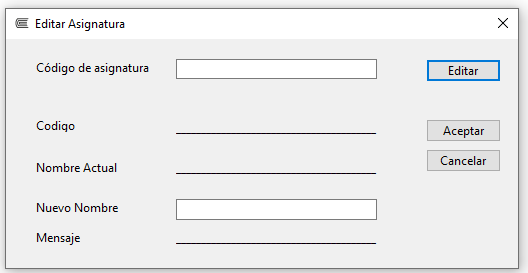

"# Final" 
## **EQUIPO DE DESARROLLO**

|**Integrante**|**Apellidos y nombres de los integrantes del equipo de desarrollo (ordenado alfabéticamente)**|**ROL**|
| :- | :- | :- |
|**1**|De la calle Coz Carlos |  Programador |
|**2**|De la Cruz Taza Geovany|  Programador |
|**3**|Galvan Durand Michael  |  Programador |

## **ÍTEM UNO**
Historia de usuario detallada: HU002.

|Identificador|HU002|
| :- | :- |
|Nombre|Editar asignaturas|
|Como [rol], quiero [descripción de la funcionalidad] para poder [beneficio o descripción de la consecuencia].
    Yo como un [rol], necesito [descripción de la funcionalidad], con la finalidad de [beneficio o descripción de la consecuencia].

Descripción[^1]
|Como docente, quiero editar los datos de una asignatura con la finalidad de actualizar el catálogo.|
|Puntos de historia (días ideales)|0.5|
|Criterios de aceptación|Debe tener un botón y sección que permita editar un código ingresado.|
||Cuando un código de asignatura no está registrado debe mostrar un mensaje de error.|
||En el cuadro de ingreso del código debe aceptar solamente números.|
||Se debe visualizar el código y nombre actual que se desea editar para evitar confusiones|
||La sección código y nombre actual no debe permitir ediciones.|
||Al editar la asignatura se debe confirmar si el cambio fue exitoso o no lo fue|
||Las tablas concernientes a los datos de asignaturas deben de visualizar los cambios.|
###
### Revisión

|Criterio|Comentario|Realizado por|Solucionado|
| :- | :- | :- | :- |
|Completo|Conforme|Grupo||
|Consistente|Conforme|Grupo||
|Negociable|Conforme|Grupo||
|Valiosa|Conforme|Grupo||
|Estimable|Conforme|Grupo||
|Pequeña|Conforme|Grupo||
|Comprobable|Conforme|Grupo|

Wireframe para la historia de usuario: HU002[^2].

[^1]: 
[^2]: Para los wireframe de cada historia de usuario puede utilizar: Lucichart, Balsamiq, Adobe xd, Pencil, etc.
